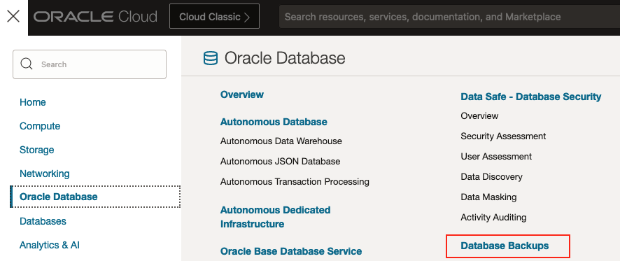
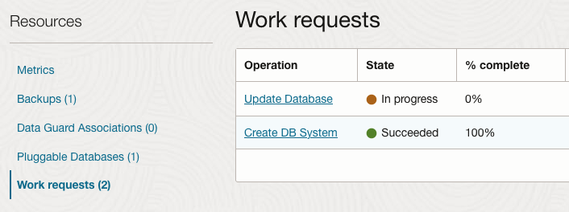
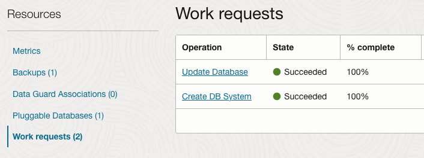

# Real-time Oracle Database protection with Autonomous Recovery Service

## Introduction

This lab shows you how to customize automatic backups for the Oracle Database with Autonomous Recovery Service as the backup destination.  The initial default backup configuration to Autonomous Recovery Service was completed to save time during the lab.

Estimated Time: 10 minutes

### Objectives

In this lab, you will:
* Create a custom protection policy
* Customize Automatic Backups for Base Database Service with real-time protection

## Task 1: Create a custom Protection Policy

1. Navigate to Database Backups
    

2. Select Protection Policies from the left menu
    

3. Click the Create protection policy button
    

4. Enter the following information to create a protection policy
    * Name: Any name you would like to use to identify the policy
    * Compartment:  The compartment being used
    * Backup retention period (in days): Enter the number of days to retain the backup

5. Click the Create button
    

## Task 2: Customize the Automatic Backup configuration for Base Database Service

1. Navigate to Base Database Service
    

2. Click on your database system name

3. Click on your database name under the Databases section

4. In the button bar at the top click the Configure automatic backups button
    

5. You can customize the automatic backups for this database
    * Backup scheduling (UTC): Select a time window to run backups from the drop-down menu
    * Backup Destination: Keep the selection for Autonomous Recovery Service from the drop-down menu
    * Protection policy: Select the custom protection policy created in the previous lab
    * Keep the selection checked for Real-time data protection
    * Deletion options after database termination: Select how to manage backups after the database is terminated

6. Click the Save changes button

## Task 3: Monitor the database update

1. The update task will appear under Resources | Work requests in the lower left of the database details page. 
> **Note:** it may take 10-20 seconds to appear.
    

2. The update will complete in approximately 5 minutes and the state will show Succeeded.  You can proceed to the next task while this update is being completed.  The database icon on the left will turn green when the work is completed.
    

## Task 4: Review the Backup information on the database page

* Under the Backup section above review the information available for the database backup.
    * Health - The health will change state if there are issues with the backups for the database.  Issue details will be displayed by hoovering over the 'i'.
    * Data loss exposure - This is the amount of time since the database was protected by a backup.  Since real-time protection is enabled this value will be 0 seconds since the database is under constant protection.
    * Last failed backup - shows any backup that has failed for the entire protection window defined in the policy
    * Next scheduled backup - shows when the time window for the next backup
    * Space used for recovery - shows the amount of space used for backup of this database, which is also the amount of space used for billing
    * Backup destination - links to the details of the Autonomous Recovery Service
    * Real-time data protection - shows if the database is being protected in real-time
    * Protection policy - shows the name of the protection policy being used for this database

## Learn More

* [Creating a Protection Policy](https://docs.oracle.com/en-us/iaas/recovery-service/doc/create-protection-policy.html#GUID-C73E254E-2019-4EDA-88E0-F0BA68082A65)
* [Back Up a Database Using the Console](https://docs.oracle.com/en/cloud/paas/bm-and-vm-dbs-cloud/dbbackupoci/index.html)
* [Documentation for Zero Data Loss Autonomous Recovery Service](https://docs.oracle.com/en/cloud/paas/recovery-service/dbrsu/)

## Acknowledgements
* **Author** - Kelly Smith, Product Manager, Backup & Recovery Solutions
* **Last Updated By/Date** - Kelly Smith, May 2023
