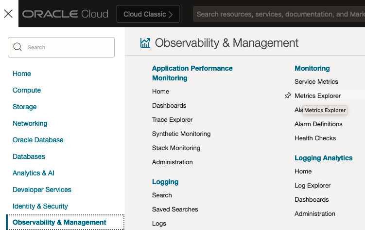
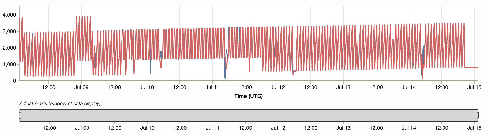
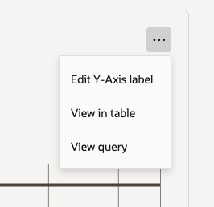
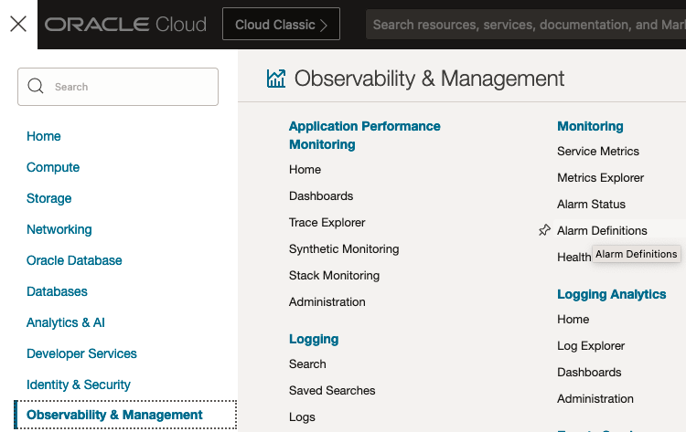

# Monitor & Create Alarms

## Introduction

This lab shows you how to use metrics to monitor backups of databases protected by the Autonomous Recovery Service.  When you used in conjunction with the OCI alarms you can be notified if the metrics exceed the threshold you specify.

Estimated Time: 10 minutes

### Objectives

In this lab, you will:
* Review protection metric 
* Configure an alarm for this metric

## Task 1: Review the protection metrics for your database

1. Navigate to Metrics Explorer
    

2. Select "Add query"

3. In the Add query dialog choose the following options:
    * Name: Recovery Service
    * Compartment: Your compartment name
    * Metric namespace: oci-recovery-service
    * Metric name: DataLossExposure
    * Interval: 15 minutes
    * Statistic: Mean

4. Click Add query

5. Review the chart at the top to see the data loss exposure for the database in your compartment.  Data loss exposure shows the time since the database was last protected by backup.  When real-time protection is enabled, the value in the chart will be zero since the database is always being protected.

    Example chart:
    

6. Click the three dots above the chart and select View in table
    

## Task 2: Set an alarm to monitor the data loss exposure

1. Navigate to Alarm Definitions
    

2. Click Create Alarm

3. Provide the follow information in the dialog under each section:
    * Define alarm:
        * Alarm name: Type a name for the alarm definition.  Ex: Data Loss Alarm
        * Alarm summary: Provide a description of the alarm.  Ex: Data Loss Exposure too high for the database
    * Choose creation Mode
        * Select basic mode
    * Metric description
        * Compartment: Your compartment name
        * Metric namespace: oci-recovery-service
        * Resource Group: leave as blacnk
        * Metric name: DataLossExposure
        * Interval: 1 minutes
        * Statistic: Mean
    * Metric dimension - leave as default
    * Trigger rule
        * operator: greater than
        * Value: 120 (provide number of seconds)
        * Trigger delay minutes: 1
        * Alarm severity: Critical
        * Alarm body: Provide any steps you would like the notification reader to follow.
    * Click Next
    * Define alarm notifications
        * Destination service: Notifications
        * Compartment: Your compartment name
        * Click Create a topic (Note: You will not be able to save the topic in the lab environment)
            * Topic name: High-Data-Loss
            * Subscription protocol: Email
            * Subscription email: Enter an email you would like to use to see the results
    * Message group - leave as default
    * Message format - leave as default

4. Note you will not be able to save the alarm in this LiveLab environment.  Click cancel and continue the the next lab section.

## Learn More

* [Using the Console to View Protected Database Metrics](https://docs.oracle.com/en/cloud/paas/recovery-service/dbrsu/console-recovery-service-metrics.html)
* [Using Alarms to Monitor Protected Databases](https://docs.oracle.com/en/cloud/paas/recovery-service/dbrsu/alarm-recovery-service-metrics.html)
* [Documentation for Zero Data Loss Autonomous Recovery Service](https://docs.oracle.com/en/cloud/paas/recovery-service/dbrsu/)

## Acknowledgements
* **Author** - Kelly Smith, Product Manager, Backup & Recovery Solutions
* **Last Updated By/Date** - Kelly Smith, August 2024
