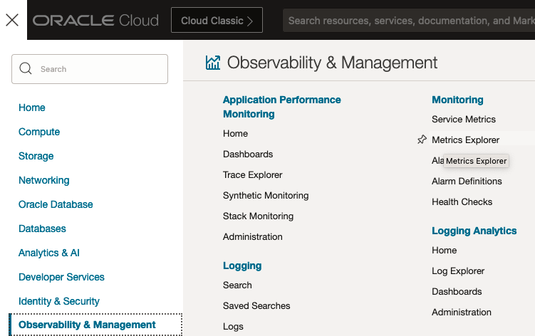

# Real-time Oracle Database protection with Autonomous Recovery Service

## Introduction

This lab shows you how to configure automatic backups for the Oracle Database with Autonomous Recovery Service as the backup destination.  After completing this workshop you should be familiar with the configuration of automatic backups for Base Database Service, real-time database protection, point-in-time recovery of a database, monitoring protection status, reporting on protection metrics, and setting alarms when metrics exceed your service level requirements.

Estimated Time: TBD minutes

### Objectives

In this lab, you will:
* Review protection metric 
* Configure an alarm for this metric

## Task 1: Review the protection metrics for your database

1. Navigate to Metrics Explorer
    

2. Select Last 7 days from the Quick selects drop down
    

3. In the Query 1 selection area choose the following options:
    * Compartment: Your compartment name
    * Metric namespace: oci_recovery_service
    * Metric name: DataLossExposure
    * Interval: 15 minutes
    * Statistic: Mean

4. Click Update Chart

5. Review the chart at the top to see the data loss exposure for the database in your compartment.  Data loss exposure shows the time since the database was last protected by backup.  When real-time protection is enabled, the value in the chart will be zero over time since the database is always being protected.

6. You can also see a table of the values by toggling the Show Data Table option
    

## Task 2: Set an alarm to monitor the data loss exposure

1. Navigate to Alarm Definitions
    

2. Click Create Alarm

3. Provide the follow information in the dialog under each section:
    * Define alarm:
        * Alarm name: Type a name for the alarm definition.  Ex: Data Loss Alarm
        * Alarm body: Provide a description of the alarm.  Ex: Data Loss Exposure too high for the database
    * Tags - leave as default
    * Metric description
        * Compartment: Your compartment name
        * Metric namespace: oci-recovery-service
        * Metric name: DataLossExposure
        * Interval: 1 minutes
        * Statistic: Mean
    * Metric dimension - leave as default
    * Trigger rule
        * operator: greater than
        * Value: 120 (provide number of seconds)
        * Trigger delay minutes: 1
    * Define alarm notifications
        * Destination service: Notifications
        * Compartment: Your compartment name
        * Click Create a topic
            * Topic name: High-Data-Loss
            * Subscription protocol: Email
            * Subscription email: Enter an email you would like to use to see the results
    * Message group - leave as default
    * Message format - leave as default

4. Click Save alarm

5. You will receive an email confirming the subscription.

6. If you would like to see the notification click Confirm subscription in the email

## Task 3:  (Optional) Trigger the alarm

1. Navigate to Base Database Service
    

2. Click on your database system under Display name

3. Click Nodes under Resources on the left
    

4. Click the 3 dots on the far right and select Stop
    

5. Click Stop node on the confirmation pop up message

6. An email will appear when the threshold is passed

## Task 4: (Optional) Delete the Alarm to stop email notification

1. Navigate to Alarm Definitions
    

2. Click the name of your alarm

3. Click the Actions menu in the top right

4. Click Delete alarm

## Appendix 1: Overview of Zero Data Loss Autonomous Recovery Service

Add information about Recovery Service

## Learn More

* [Website for Zero Data Loss Autonomous Recovery Service](https://oracle.com/zrcv)
* [Blog Introducing the Oracle Database Zero Data Loss Autonomous Recovery Service](https://blogs.oracle.com/maa/post/introducing-recovery-service)
* [Documentation for Zero Data Loss Autonomous Recovery Service](https://docs.oracle.com/en/cloud/paas/recovery-service/dbrsu/)

## Acknowledgements
* **Author** - Kelly Smith, Product Manager, Backup & Recovery Solutions
* **Last Updated By/Date** - Kelly Smith, May 2023
