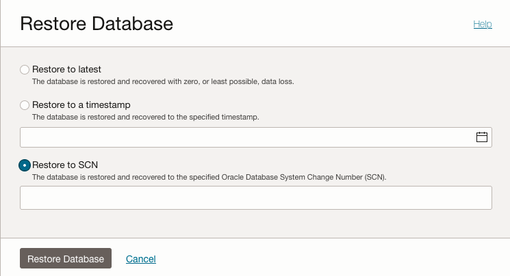
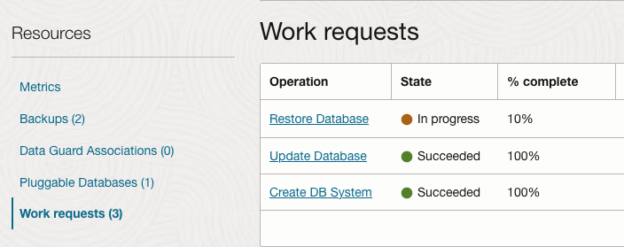

# Perform Point-in-time restores

## Introduction

This lab shows you how to recover from malicious behavior.  Notice that the automatic backups configured for this Oracle Database with Autonomous Recovery Service as the backup destination uses real-time protection.  This means that database transactions are being protected as they occur on the database, so you can easily go back to the point just before the malicious behavior to recover the database without having to worry about when the last backup happened.

Estimated Time: 15 minutes

### Objectives

In this lab, you will:
* Connect to the Oracle Database
* Create data in the Oracle Database
* Maliciously destroy Oracle Database data
* Perform a point-in-time recovery using the SCN just prior to the malicious activity

## Task 1: Get the details for your database node

1. Navigate to Oracle Base Database Service
    

2. Click on your database system under Display name

3. Click Nodes under Resources on the left
    

4. Copy the Public IP address

## Task 2: Connect to the database, create a table and insert data

1. SSH into the host using the follow command:
    ```
    <copy>ssh -i <private_key_file> opc@<public-ip-address> </copy>
    ```

2. Change user to Oracle:
    ```
    $ <copy>sudo su - oracle</copy>  
    ```
3. Connect to the database:
    ```
    $ <copy>sqlplus / as sysdba</copy> 
    ```

4. Create a table for customers:
    ```
    SQL> <copy>create table customer(first_name varchar2(50));</copy>
    ```
5. Insert new customers:
    ```
    SQL> <copy>INSERT INTO customer (first_name) 
            WITH names AS (
                SELECT 'Andrew' FROM dual UNION ALL
                SELECT 'Bob' FROM dual UNION ALL
                SELECT 'Mike' FROM dual
            )
            SELECT * FROM names;</copy>
    ```
    ```
    SQL> <copy>commit;</copy>
    ```

6. Query to see the customer names:
    ```
    SQL> <copy>select * from customer;</copy>
    ```

7. Capture the SCN for the database before being malicious:
    ```
    SQL> <copy>Select CURRENT_SCN as BEFORE_DELETE from v$database;</copy>
    ```

## Task 3: Be malicious and destroy data!

1. Drop the table
    ```
    SQL> <copy>drop table customer;</copy>
    ```
    ```
    SQL> <copy>commit;</copy>
    ```

2. Query the customer table to see that it is gone:
    ```
    SQL> <copy>select * from customer;</copy>
    ```

3. Force a database shutdown
    ```
    SQL> <copy>SHUTDOWN ABORT</copy>
    SQL> <copy>exit</copy>
    ```

4. Force delete all the logs, backups, controlfiles and datafiles from the disk
    ```
    $ <copy>cd /u03/app/oracle/</copy>
    ```
    ```
    $ <copy>find . \( -name "*.log" -o -name "*.arc" -o -name "*.bkp" -o -name "*.ctl" \) -delete</copy>
    ```
    ```
    $ <copy>cd /u02/app/oracle/oradata</copy>
    ```
    ```
    $ <copy>find . \( -name "*.ctl" -o -name "*.dbf" \) -delete</copy>
    ```

## Task 4: Recover the database to the point before the malicious behavior

1. Navigate to Oracle Base Database Service
    

2. Click on your database system under Display name

3. Click on your database name at the bottom under Databases
    

4. Click Restore on the button bar
    

5. Select Restore to SCN in the Restore Database dialog
    

6. Enter the SCN captured from BEFORE_DELETE in Task 2, Step 7 above

7. Click Restore Database

8. The restore will take approximately 10 minutes and you can track progress under the Work requests at the bottom left
    

9. You can continue to the next lab and return after the restore is complete.  After the restore is complete query the customer table:
    ```
    <copy>sqlplus / as sysdba</copy>
    ```
    ```
    <copy>select * from customer;</copy>
    ```


## Learn More

* [Recovering a Database](https://docs.oracle.com/en-us/iaas/recovery-service/doc/recovering-database.html#GUID-6E88692E-FCFA-4CFE-844C-00A79E8D079B)
* [Documentation for Zero Data Loss Autonomous Recovery Service](https://docs.oracle.com/en/cloud/paas/recovery-service/dbrsu/)


## Acknowledgements
* **Author** - Kelly Smith, Product Manager, Backup & Recovery Solutions
* **Last Updated By/Date** - Kelly Smith, May 2023
